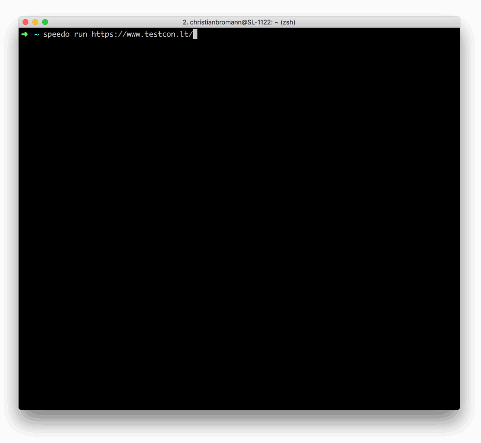

Speedo  [](https://codecov.io/gh/saucelabs/speedo)
======

Sauce Labs provides a [Frontend Performance Testing](https://wiki.saucelabs.com/display/DOCS/Getting+Started+with+Sauce+Front-End+Performance) offering that allows you to check for crucial performance regression on your website. `Speedo` is a simple to use CLI tool that allows you to integrate this into your CI/CD pipeline. All you need to do is download and run it, just like that:



## Download

To download the tool you have to have Node.js installed on your machine. After you have installed it, run:

```sh
$ npm install -g speedo
```

## Update

```sh
$ speedo --version
// => 1.2.2

$ npm install -g speedo@latest

$ speedo --version
// => 1.2.3
```

## Usage

If you call `speedo -h` you find the following help menu:

```
Speedo CLI runner

Commands:
  speedo analyze [params...] <jobName>  Analyze results of prerun performance
                                        tests.
  speedo run [params...] <site>         Run performance tests on any website.

Options:
  --version        Show version number                                 [boolean]
  --help, -h       prints speedo help menu                             [boolean]
  --user, -u       your Sauce Labs username
  --key, -k        your Sauce Labs user key
  --region, -r     your Sauce Labs datacenter region, the following regions are
                   available: `us-west-1` (short `us`), `eu-central-1` (short
                   `eu`)                                         [default: "us"]
  --logDir, -l     directory to store logs from testrun
  --traceLogs, -t  if set runner downloads tracing logs for further
                   investigations
```

### Run Tests

After you have installed the tool, run it via

```sh
speedo run https://google.com -u <your-username> -k <your-access-key>
```

If you export `SAUCE_USERNAME` and `SAUCE_ACCESS_KEY` into your environment you don't need to pass in the user and key as parameter:

```sh
export SAUCE_USERNAME=<your-username>
export SAUCE_ACCESS_KEY=<your-access-key>
speedo run https://google.com
```

You can customize your performance tests by appliying a job and build name or restricting the assertion to specific metrics only. For more information on parameters run `$ speedo run --help`.

```sh
# give performance test a build and job name and restrict metrics
speedo run https://google.com -n my-performance-test -b $BUILD_ID -m speedIndex -m timeToFirstInteractive -m firstPaint
# or retry performance test at least 3 times in case it fails
speedo run https://google.com --retry 3
```

Speedo allow you to assert on the following performance metrics:

- firstPaint
- firstContentfulPaint
- firstMeaningfulPaint
- domContentLoaded
- timeToFirstInteractive
- load
- speedIndex
- perceptualSpeedIndex
- pageWeight
- pageWeightEncoded
- largestContentfulPaint
- totalBlockingTime
- cumulativeLayoutShift

#### Parameters

To get the whole list of command options for the `run` command call `speedo run -h`. You can either apply parameters via command line arguments or through a config file. By default Speedo looks into the directory where it is being called if a `speedo.config.js` exists. You can define different file path with the `--config` parameter.

##### `config` (short: `-c`)

Path to Speedo config file to read parameters from.

_default:_ `./speedo.config.js`

##### `platformName` (short: `-p`)

Define the platform the performance test should run in (e.g "Windows 10").

_default:_ `"Windows 10"`

##### `browserVersion` (short: `-v`)

Define the browser version of Chrome the performance test should run in (e.g. "latest").

_default:_ `74`

##### `build` (short: `-b`)

Provide the name of the build you want to run your performance test in.

##### `name` (short: `-n`)

Define the name of your performance test.

_default:_ `"Performance test for <your-site-url> (on "Good 3G" and 4x CPU throttling)"`

##### `metric` (short: `-m`)

Define the metric that you want to check (multiple possible). Available performance metrics are `domContentLoaded`, `firstVisualChange`, `firstPaint`, `firstContentfulPaint`, `firstMeaningfulPaint`, `lastVisualChange`, `firstInteractive`, `load`, `speedIndex`, `score`, `largestContentfulPaint`, `totalBlockingTime`, `cumulativeLayoutShift`.

_default:_ `"score"` ([Lighthouse Performance Score](https://developers.google.com/web/tools/lighthouse/scoring))

##### `all`

Assert on all available metrics (ignores what is being set as `metric` parameter).

_default:_ `false`

##### `throttleNetwork`

Throttle network speed for your test (e.g. "Good 3G"). Available throttling profiles are: `offline`, `GPRS`, `Regular 2G`, `Good 2G`, `Regular 3G`, `Good 3G`, `Regular 4G`, `DSL`, `Wifi`, `online`. You can also define your custom network profile by providing 3 with comma separated numbers for download (_kb/s_), upload (_kb/s_) and latency (_ms_), e.g. `1000,500,40`.

_default:_ `"Good 3G"`

##### `throttleCpu`

Throttle CPU speed for your test (e.g. "4" for 1/4 speed).

_default:_ `4`

##### `device`

If set, the provided mobile device is emulated. You can choose between the following preconfigured device profiles: `Blackberry PlayBook`, `BlackBerry Z30`, `Galaxy Note 3`, `Galaxy Note II`, `Galaxy S III`, `Galaxy S5`, `iPad`, `iPad Mini`, `iPad Pro`, `iPhone 4`, `iPhone 5`, `iPhone 6`, `iPhone 6 Plus`, `iPhone 7`, `iPhone 7 Plus`, `iPhone 8`, `iPhone 8 Plus`, `iPhone SE`, `iPhone X`, `iPhone XR`, `JioPhone 2`, `Kindle Fire HDX`, `LG Optimus L70`, `Microsoft Lumia 550`, `Microsoft Lumia 950`, `Nexus 10`, `Nexus 4`, `Nexus 5`, `Nexus 5X`, `Nexus 6`, `Nexus 6P`, `Nexus 7`, `Nokia Lumia 520`, `Nokia N9`, `Pixel 2`, `Pixel 2 XL`. If you don't want to emulate a mobile device set `desktop`.

_default:_ `Nexus 7`

##### `retry`

Rerun failing performance tests.

_default:_ `0`

##### `tunnelIdentifier` (short: `-i`)

Define the identifier for Sauce Connect tunnel to run performance tests for local hosted app

##### `parentTunnel`

Define the username of your parent account that is running Sauce Connect tunnel.

##### `budget`

Provide metrics threshold values as `budget` in `speedo.config.js` file to strictly assert metrics value against a performance budget. It will assert on metrics which is declared in budget (ignores what is being set as `metric` parameter). `minimum` and `maximum` threshold can be set as shown in below example.

i.e.
```js
// speedo.config.js
module.exports = {
    budget: {
        load: 500, // maximum
        speedIndex: [100, 500] // [minium, maximum]
    }
}
```

##### `jankiness`

Provide "jankiness" score threshold value either via CLI param or in `budget` in `speedo.config.js` file. The value should be between 0 to 100 as parameter and checks the smoothness of the page. `minimum` and `maximum` threshold can be set same as shown in `budget` section. Jankiness score threshold can be provided as CLI param in `"[minimum, maximum]"` or `"minimum"`  format as shown in below example.

```sh
$ speedo run https://google.org --jankiness "[50, 100]"
```

```sh
$ speedo run https://google.org --jankiness "50"
```


#### Run Speedo with a Config File

As mentioned above Speedo looks for a `speedo.config.js` in the directory where you run the command. In this file you can define all parameters for your performance test run. Additional command line arguments will overwrite the parameters from the config, e.g.:

```js
// speedo.config.js
module.exports = {
    retry: 2,
    build: `Performance Build ${CI_BUILD_NUMBER}`,
    device: 'Nexus 7',
    throttleCPU: 6
}
```

If you call Speedo with:

```sh
$ speedo run https://google.org --retry 4
```

The command will retry the performance test 4 times instead of 6.

### Analyze Tests

Speedo provides also a way to analyze the performance of page loads of a previous run test. This allows you to run a beforehand that includes different automation steps to arrive to a desired page (e.g. you want to test the performance of a page that is behind a login). __Please Note:__ do __not__ analyze the performance of all your previous run functional tests! You always should keep functional and performance tests separated.

Let's say we want to test the performance of the page behind the login form of [this example](https://the-internet.herokuapp.com/login). The first step is to create a simple automation script that uses Sauce Labs to log into the page. You can use any framework you like, it doesn't affect the performance results whatsoever. In this example we use [WebdriverIO](https://webdriver.io/):

```js
// /test/performance/login.perf.test.js
const { remote } = require('webdriverio');

(async () => {
    const client = await remote({
        user: process.env.SAUCE_USERNAME,
        key: process.env.SAUCE_ACCESS_KEY,
        capabilities: {
            browserName: 'chrome',
            platform: 'macOS 10.13',
            version: 'latest',
            extendedDebugging: true,
            capturePerformance: true,
            name: 'my login performance test'
        }
    })

    await client.url('https://the-internet.herokuapp.com/login')

    const username = await client.$('#username')
    await username.setValue('tomsmith')

    const password = await client.$('#password')
    await username.setValue('SuperSecretPassword!')

    const submit = await client.$('button[type="submit"]')
    await submit.click()

    await client.deleteSession())
})().catch(console.error)
```

Ensure that you define a unique name for your performance test so we can maintain a stable baseline for it. Within your CI/CD you can now call the script and analyze the performance of the second opened page. To ensure that our platform can calculcate the data we add a 5 second pause in between running the test and analyzing it:

```sh
node /test/performance/login.perf.test.js && sleep 5 && speedo analyze "my login performance test" --orderIndex 1
```

The command requires passing in the job name of the performance test. With the `orderIndex` parameter you can define which page load needs to be analyzed. If not passed in, it will analyze all page loads which can make tests more flaky. Similar to `run` you can apply more parameters to this command. See the full list by calling `$ speedo analyze --help`.

#### Parameters

To get the whole list of command options for the `run` command call `speedo analyze -h`.

##### `orderIndex` (short: `-o`)

Define the order index of the page you have opened in that test. For example, if set to 0 you analyze the first page load, if set to 2 you want to analyze the 3rd page load.

##### `pageUrl` (short: `-p`)

Define the url of the page you have opened in that test (ignores `--orderIndex` parameter).

##### `metric` (short: `-m`)

Define the metric that you want to check (multiple possible). Available performance metrics are `domContentLoaded`, `firstVisualChange`, `firstPaint`, `firstContentfulPaint`, `firstMeaningfulPaint`, `lastVisualChange`, `firstInteractive`, `load`, `speedIndex`, `score`, `largestContentfulPaint`, `totalBlockingTime`, `cumulativeLayoutShift`.

_default:_ `"score"` ([Lighthouse Performance Score](https://developers.google.com/web/tools/lighthouse/scoring))

##### `all`

Assert on all available metrics (ignores what is being set as `metric` parameter).

_default:_ `false`

## Docker Integration

If you run your CI/CD pipeline based on Docker (e.g. [Jenkins Pipelines](https://jenkins.io/doc/book/pipeline/docker/)) you can also use Speedo as a Docker container. Just define the container name and have the speedo command available in the stage, e.g.:

```
pipeline {
    agent none
    stages {
        stage('Linting') {
            ...
        }
        stage('Unit Tests') {
            ...
        }
        stage('Functional Tests') {
            ...
        }
        stage('Performance Tests') {
            agent {
                docker { image 'saucelabs/speedo' }
            }
            steps {
                sh 'speedo run https://google.com -u ${SAUCE_USERNAME} -k ${SAUCE_ACCESS_KEY} -b ${BUILD_NUMBER}'
            }
        }
    }
}
```

Or when using [GitLab CI/CD](https://docs.gitlab.com/ee/ci/pipelines.html) pipelines:

```yaml
variables:
  SPEEDO_IMAGE: saucelabs/speedo

stages:
  - lint
  - test
  - performance
  - deploy

# ...

# run performance tests
performance:
  stage: performance
  image: $SPEEDO_IMAGE
  script:
    - speedo run https://google.com -u $SAUCE_USERNAME -k $SAUCE_ACCESS_KEY -b $BUILD_NUMBER

# ...
```

For information on how to contribute to this project, see [CONTRIBUTING.md](CONTRIBUTING.md).
